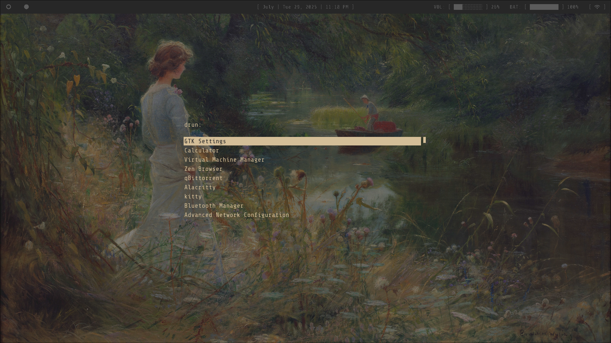

[](https://git.io/typing-svg)
## Details

```
    > OS: Arch Linux

    > WM: Hyprland

    > Topbar: Waybar

    > Menu: Rofi

    > Notification daemon: mako

    > GTK: Gruvbox

    > Font: ShareTech Mono Nerd Fonts

    > Terminal: Foot

    > TextEditor: Neovim && Doom Emacs

    > File manager: nnn
```

## ScreenShots


### Terminal (foot)


### Menu (Rofi)


### Status Bar (Waybar)


## Requirements

Ensure you have the following installed on your system

### Git

```
$ sudo pacman -S git
```

### Stow

```
$ sudo pacman -S stow
```

## Installation

First, check out the dotfiles repo in your $HOME directory using git

```
$ git clone git@github.com/rootankush/dotfiles.git
$ cd dotfiles
```

then use GNU stow to create symlinks

```
$ stow .
```

## ADD config or UPDATE config

How to add config files to dotfiles or update dotfiles

```
$ cp -r [destination of file] .config
$ git add {The thing you changed}
$ git commit -m "(write somthing here)"
$ git push origin main
$ stow .
```

if after using stow . u get duplicate file error

```
$ rm -r [the file u want to delete]
```

## Guide Youtube Video

```
https://youtu.be/y6XCebnB9gs?si=X1saNfgNL4CBc_QP
```
